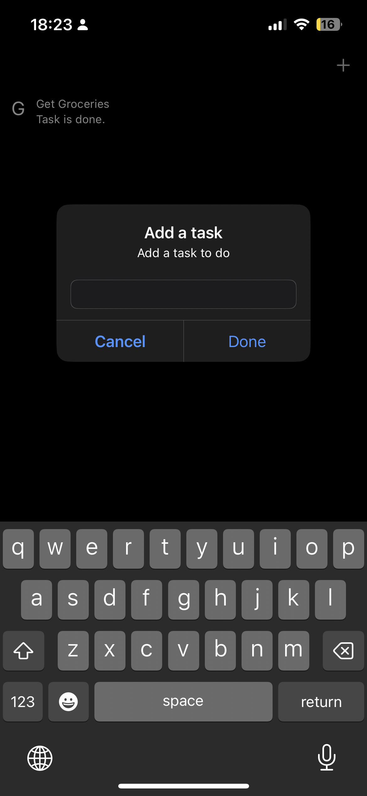

# To-Do


### Display task and when they are done





> Initializing persistent container 

```

class CoreDataManager {
    
    let persistenceContainer: NSPersistentContainer
    
    static let shared = CoreDataManager()
    
    
    private init(){
        persistenceContainer = NSPersistentContainer(name: "TodoModel")
        persistenceContainer.loadPersistentStores { desc, error in
            if let error = error {
                print(error.localizedDescription)
            }
        }
    }
}

```
